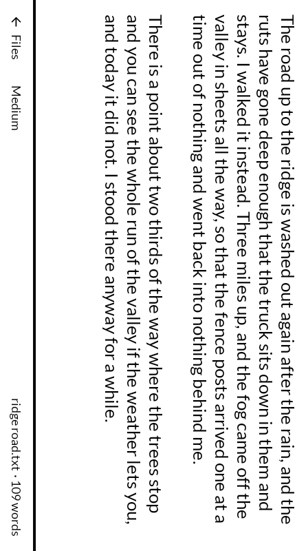
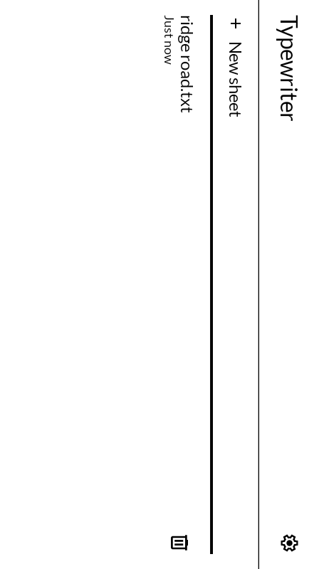
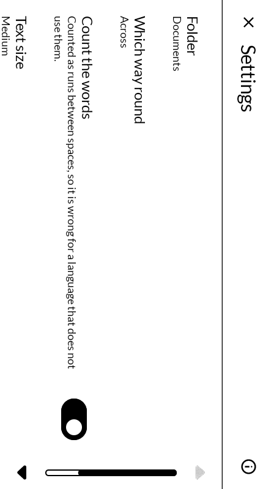
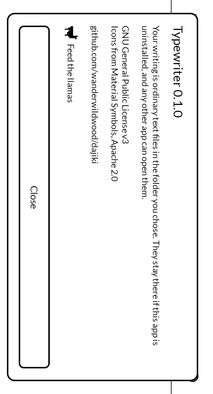

# 打字機 dajiki — Typewriter

A text editor that opens in landscape and stays there, for an E Ink phone with a Bluetooth
keyboard plugged into it. Built for the [Mudita Kompakt](https://mudita.com/products/kompakt/),
and it will install on any Android 12 device.

*Dajiki* is 打字機 — the character-striking machine. Nobody has said it in Japanese since the
war; タイプライター is the live word. The old one is here on purpose, for a machine that does
one thing slowly on a grey screen.

Not a fork. Written from scratch in Kotlin and Jetpack Compose, using Mudita's own
[MMD](https://github.com/mudita/MMD) design system so it looks like the apps the phone
already ships with.

| | |
|---|---|
|  |  |
|  |  |

*Turned a quarter, because the screen is landscape and this page is not. Tilt your head to
the right.*

## Why it exists

Because turning an E Ink phone into a writerdeck currently means one of two bad options.

The editors that force landscape do it with an invisible overlay window and a foreground
service, which works — it is the only thing that *does* work against an app whose manifest
declares portrait — but it costs a permanent notification and something running whenever you
are not writing. And the editors that are already on the phone are portrait-locked in their
own manifests, which no system setting anywhere can override.

An activity that declares its own orientation needs nothing running behind it. That is the
entire trick, and it is one line of a manifest. Everything else here is the text editor that
line needed to be attached to.

## What it does

- **Opens in landscape and stays there**, with nothing in the background holding it. Turned
  around, or following the device, if a keyboard case wants it the other way up. None of the
  three needs an accelerometer, which several of these panels do not have.
- **Keeps your writing as ordinary text files in a folder you choose**, through the system
  picker — so it can be a folder a sync app already owns, and the files are still there if
  this app is uninstalled. No storage permission is asked for, because that grant is not a
  permission.
- **Ctrl-S, Ctrl-N, Ctrl-O and Escape**, and **Ctrl-Z to take back what you just typed**.
  Everything else a keyboard does — Home, End, page keys, shift to select, word-wise arrows —
  is the platform's text field doing what it already does correctly, untouched.
- **Saves two seconds after you stop typing**, and again on the way out of the app. The foot
  of the page says when what you see is not yet on disk.
- **Never writes over a sheet that changed somewhere else.** The folder is meant to be one a
  sync app owns, so the ordinary case is a laptop editing the same sheet while the phone has
  it open. Before every save the sheet is checked against what it looked like when this app
  last touched it; if it has moved on, nothing is written over it and what you typed goes
  into `<name> (this phone).txt` beside it, which the page then follows. You get both copies
  and sort it out on a machine with a screen — you are never asked to choose between two
  versions on a 4.3" panel, mid-sentence, with no way to see what the other one says.
  Coming back to the app with nothing unsaved simply shows whatever arrived.
- **Counts the words**, a moment behind the typing rather than on every keystroke, because
  repainting the foot of an E Ink panel on every character is a flicker you would watch all
  afternoon.

## What it does not do

No permissions at all — nothing is asked of you, and there is no `INTERNET` permission, so it
cannot open a network connection even by accident. (Read the built APK rather than the manifest
and you will find one entry, `…DYNAMIC_RECEIVER_NOT_EXPORTED_PERMISSION`; AndroidX defines that
inside this app's own package so a runtime broadcast receiver is not exposed to other apps. It
is a lock rather than a key. PRIVACY.md says so at length.) No network — the one web address in
the app is handed to a browser.
No formatting, no preview, no spellcheck, no themes. It does not sync, and does not want to:
it writes files into a folder, and whatever already syncs that folder does the rest. It does
not merge two versions of a sheet either — it keeps both and says so. And it does not rename:
a new sheet is named for the date and time it was started, and any file manager will rename
it.

## Where this is up to

Version 0.1.0. The word count and the change-detection rules are unit tested, every screen
has been driven on a device, and the save path has been checked against the things that
actually lose writing — shortening a sheet leaves no tail of the old one behind it, and a
sheet that changed underneath the app is copied rather than overwritten.

A document of 5,227 words has been through it, and typing into it costs exactly what typing
into a two word one costs — measured, with the short document as a control, because the
absolute frame numbers off an emulator are worth nothing on their own.

What has **not** happened is anybody writing anything real in it. No afternoon's work has
gone through it, which is the test that matters for a writing app, and the panel it is meant
for is slower than anything this has been measured on.

The keyboard shortcuts are confirmed. Ctrl-O went to the folder without typing an `o`,
Ctrl-S wrote the sheet before the pause could have, Ctrl-N started one, and Escape closed
the page. That took some getting at: the emulator's keyboard uses a layout with no Ctrl key
defined in it at all, so every combination arrived as a bare letter until the layout was
replaced.

The icon is a placeholder.

## Building

```
./gradlew assembleDebug
```

A release build needs a keystore at `signing/signing.keystore` with a matching
`signing/signing.properties`. There is no fallback key in this repository: without one, a
release build comes out unsigned rather than wrongly signed.

## Licence

GNU General Public License v3.0 only. Copyright wander wildwood.

Icons are from Material Symbols, Apache 2.0.
